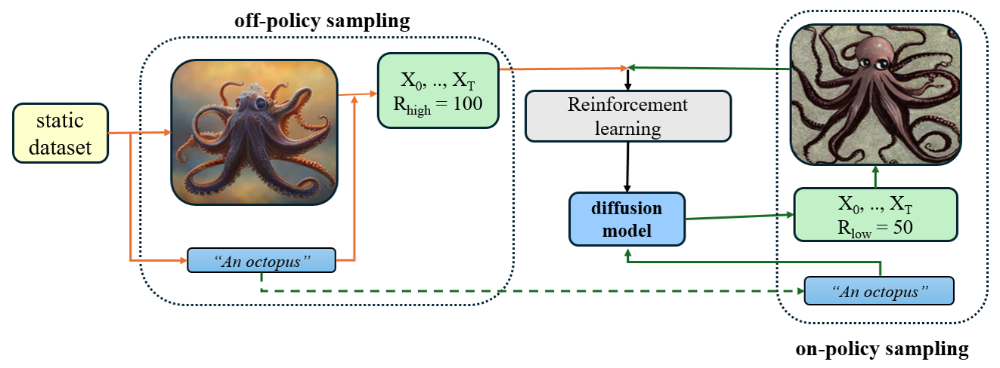
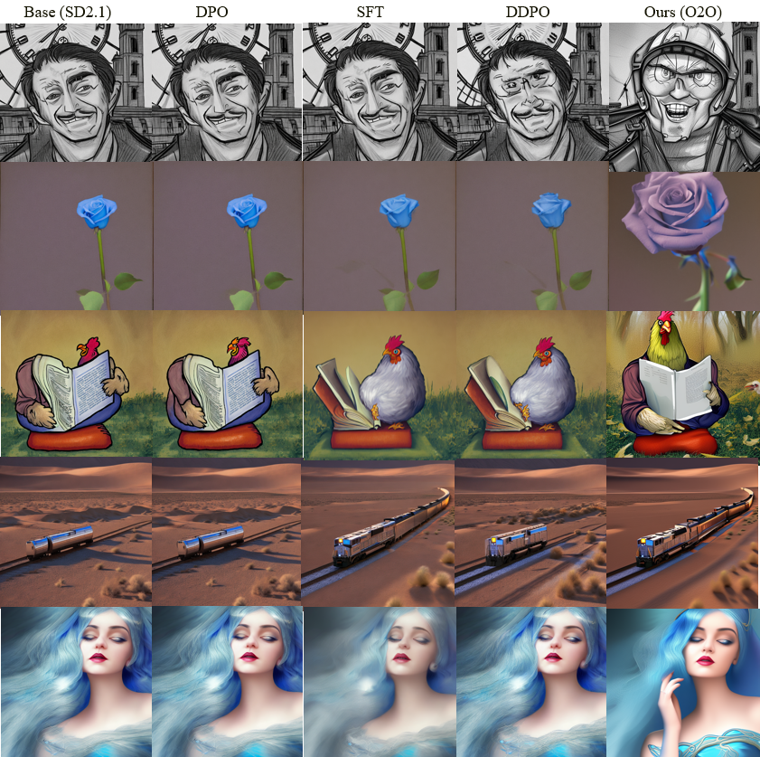
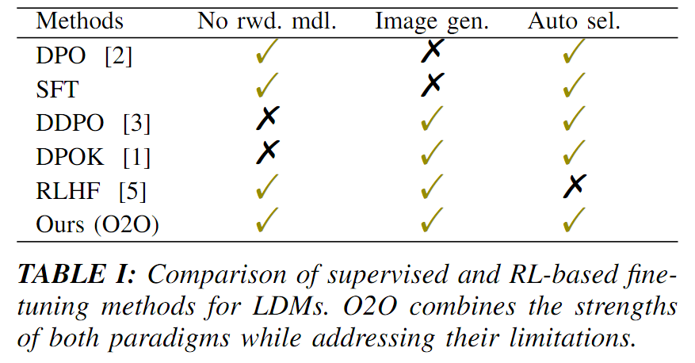

##  1. 
This is an implementation of O2O Off-policy On-policy Optimization

Fig. A: O2O: Off-Policy On-Policy Optimization. A high reward of 1 is assigned to all images from the static dataset for off-policy sampling and a low reward of 0 to all generated images for on-policy sampling without using any reward models

Fig. B: This figure compares four fine-tuning methods, DPO, SFT, DDPO, and our proposed O2O, applied to SD2.1. 

Fig. C: Method comparision

##  2. Saved model:
- Wandb training link:
https://wandb.ai/hoan-17/Dev/runs/0kq7hjje
- Inference:
!pip install trl[diffusers] wandb torchvision -U peft

import torch
from IPython.display import display, Image
from diffusers import StableDiffusionPipeline

pipeline = StableDiffusionPipeline.from_pretrained("hoan17/stablediffusion2.1bk")
device = torch.device("cuda") if torch.cuda.is_available() else torch.device("cpu")
pipeline.vae.to(device, torch.float16)
pipeline.text_encoder.to(device, torch.float16)
pipeline.unet.to(device, torch.float16)

<!-- Base model images -->
results.images[0].save("./im.png")
display(Image(filename="./im.png",width=256))

<!-- O2O trained model images -->

pipeline.load_lora_weights("hoan17/D500s200x3")
results = pipeline([prompt])
results.images[0].save("./im.png")
display(Image(filename="./im.png",width=256))

##  3. Training:
''' 
- Log in wandb and huggingface
!pip install trl[diffusers] wandb torchvision -U peft

(low GPU Memory)
!python o2o.py \
    --num_epochs=1 \
    --max_loop=500 \
    --log_with="wandb" \
    --pretrained_model="stabilityai/stable-diffusion-2-1" \
    --huggingface_note="Saving" \

(high GPU Memory)
!python o2o.py \
    --num_epochs=1 \
    --max_loop=500 \
    --offpolicy_sample_batch_size=3\
    --train_batch_size=6  \
    --log_with="wandb" \
    --pretrained_model="stabilityai/stable-diffusion-2-1" \
    --huggingface_note="Saving" \
'''
##  4. Base code:
'''
 This code builds on top of DDPO trl: https://github.com/huggingface/trl/tree/v0.23.1/trl/trainer
 
🤗 `trl` provides a [`DDPOTrainer` class](https://huggingface.co/docs/trl/ddpo_trainer) which lets you fine-tune Stable Diffusion on different reward functions using DDPO. 
The integration supports LoRA, too.  You can check out the [supplementary blog post](https://huggingface.co/blog/trl-ddpo) for additional guidance. 
'''

